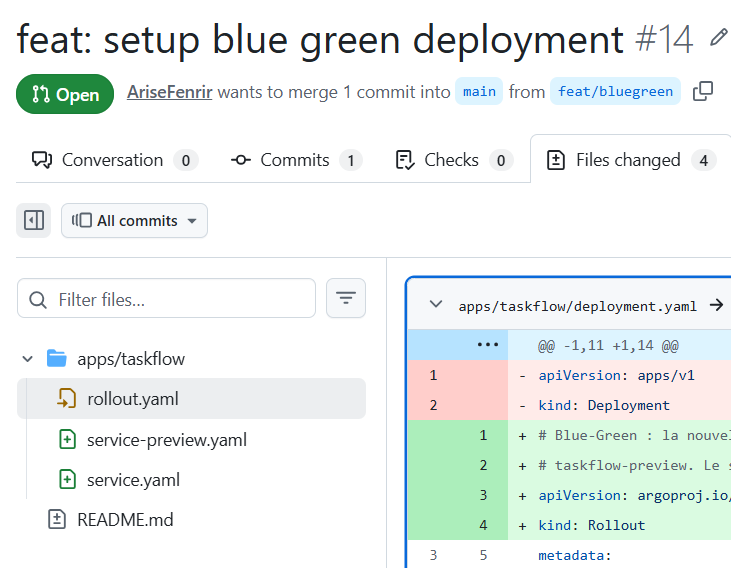
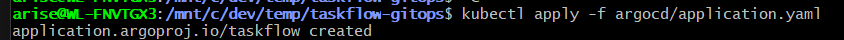
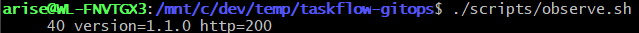
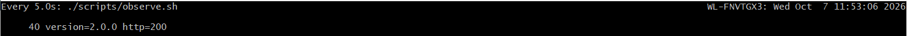

# taskflow-gitops — dépôt GitOps du cours CI/CD M2

Ce dépôt décrit **l'état voulu** de l'application TaskFlow dans Kubernetes.
Argo CD le surveille et aligne le cluster dessus : pour changer la production,
on ne tape pas de commande, on fait une **Pull Request**.

## Installation (à faire chez vous, avant le cours)

Prérequis : Docker Desktop démarré, 8 Go de RAM, 10 Go de disque libre.
Sous Windows : WSL2 (Ubuntu) + intégration WSL de Docker Desktop, et toutes les commandes dans WSL.

```bash
git clone https://github.com/9m7fjfpv9k-cyber/taskflow-gitops.git
cd taskflow-gitops
./scripts/install.sh
```

Le script crée un cluster local `kind`, installe Argo CD et Argo Rollouts,
puis télécharge les images des labs. Comptez 5 à 15 minutes.
Il peut être relancé sans risque.

## Structure

| Chemin | Rôle |
| --- | --- |
| `apps/taskflow/` | Les manifests surveillés par Argo CD |
| `argocd/application.yaml` | Déclare l'application dans Argo CD |
| `exemples/bluegreen/` | Manifests pour le déploiement Blue-Green |
| `exemples/canary/` | Manifests pour le déploiement Canary |
| `scripts/install.sh` | Installation de l'environnement |
| `scripts/argocd-ui.sh` | Ouvre l'interface d'Argo CD |
| `scripts/observe.sh` | Montre quelle version répond, et avec quel code HTTP |

## Images disponibles

`ghcr.io/9m7fjfpv9k-cyber/taskflow` en versions `1.0.0`, `1.1.0`, `2.0.0` et `2.1.0`.

## Équipe

<!-- Noms du binôme -->
- Dubois Thomas
- Jennifer Vernet

ruleset creer sur main


On ne peux pas push :


ajout du pseudo dans application.yaml


lancement du script d'installation


on apply le manifeste Argo CD


On vérifie que l'application est bien synchronisée dans Argo CD (sync status et health status).


on lance le script d'observation pour vérifier la répartition du trafic


Création de la première Pull Request pour déployer la nouvelle version de TaskFlow.


on a appliquer la pr et l'application est synchronisée dans Argo CD.(pr applique a 11h52) au bout de 1 minute environ car dans le screen le changment a eu lieu a 11h53
