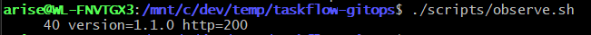
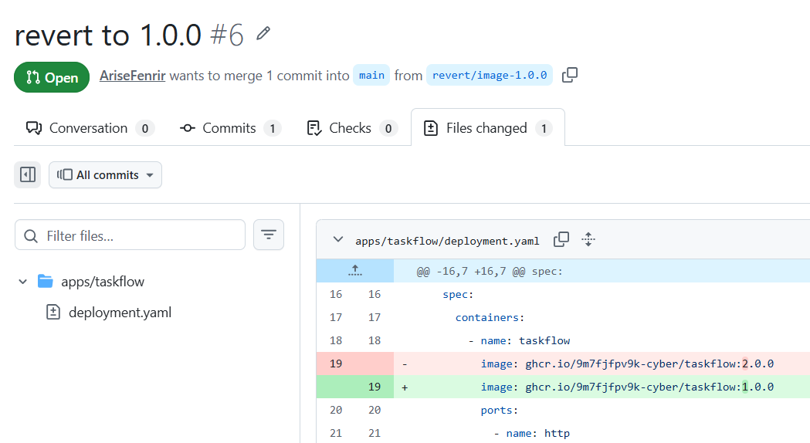
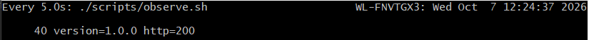

# taskflow-gitops — dépôt GitOps du cours CI/CD M2

Ce dépôt décrit **l'état voulu** de l'application TaskFlow dans Kubernetes.
Argo CD le surveille et aligne le cluster dessus : pour changer la production,
on ne tape pas de commande, on fait une **Pull Request**.

## Installation (à faire chez vous, avant le cours)

Prérequis : Docker Desktop démarré, 8 Go de RAM, 10 Go de disque libre.
Sous Windows : WSL2 (Ubuntu) + intégration WSL de Docker Desktop, et toutes les commandes dans WSL.

```bash
git clone https://github.com/9m7fjfpv9k-cyber/taskflow-gitops.git
cd taskflow-gitops
./scripts/install.sh
```

Le script crée un cluster local `kind`, installe Argo CD et Argo Rollouts,
puis télécharge les images des labs. Comptez 5 à 15 minutes.
Il peut être relancé sans risque.

## Structure

| Chemin | Rôle |
| --- | --- |
| `apps/taskflow/` | Les manifests surveillés par Argo CD |
| `argocd/application.yaml` | Déclare l'application dans Argo CD |
| `exemples/bluegreen/` | Manifests pour le déploiement Blue-Green |
| `exemples/canary/` | Manifests pour le déploiement Canary |
| `scripts/install.sh` | Installation de l'environnement |
| `scripts/argocd-ui.sh` | Ouvre l'interface d'Argo CD |
| `scripts/observe.sh` | Montre quelle version répond, et avec quel code HTTP |

## Images disponibles

`ghcr.io/9m7fjfpv9k-cyber/taskflow` en versions `1.0.0`, `1.1.0`, `2.0.0` et `2.1.0`.

## Équipe

<!-- Noms du binôme -->
- Dubois Thomas
- Jennifer Vernet

ruleset creer sur main


On ne peux pas push :


ajout du pseudo dans application.yaml


lancement du script d'installation


on apply le manifeste Argo CD


On vérifie que l'application est bien synchronisée dans Argo CD (sync status et health status).


on lance le script d'observation pour vérifier la répartition du trafic


Création de la première Pull Request pour déployer la nouvelle version de TaskFlow.


on a appliquer la pr et l'application est synchronisée dans Argo CD.(pr applique a 11h52) au bout de 1 minute environ car dans le screen le changment a eu lieu a 11h53


on a mis le nombre de replicas a 1


mais on remaque que tout de suite argo cd repasse a 4 replicas, car il aligne l'état du cluster sur l'état voulu défini dans Git.


on test de changer l'image manuellement et dans l'observation on remarque qu'elle repasse tout de suite a 2.0.0



Pour le revert on a fait une autre pr pour ajouter les info du read me ce qui bloque le revert 


afin de faire le revert on a donc fais une branche dans laquelle on a changer l'image et qu'on merge dans la main 

pr pour le revert


a 12h22 on a merge la PR pour le revert et l'application est revenue à l'état précédent.

et a 12h24 on remarque qu'on est bien repasser en 1.0.0



Push ou Pull ?
Argo CD fonctionne en mode Pull. C'est lui qui interroge le dépôt Git toutes les 60 secondes pour vérifier s'il y a des changements. Personne ne "pousse" vers le cluster — c'est Argo CD qui tire l'état depuis Git et l'applique.

Qui a corrigé quoi ?

Lors de la dérive, c'est Argo CD qui a corrigé automatiquement les modifications manuelles (kubectl scale, kubectl set image). Grâce à selfHeal: true, il a détecté que l'état du cluster ne correspondait plus à l'état décrit dans Git, et il a resynchronisé le cluster sur le dépôt Git (source de vérité).

Pourquoi git revert ?

Parce que dans une approche GitOps, le dépôt Git est la seule source de vérité. On ne fait jamais de modification directement sur le cluster. Pour revenir en arrière (ex: de 2.0.0 à 1.0.0), on ne fait pas kubectl set image — on fait un revert de la PR sur GitHub, ce qui recrée l'ancien état dans Git. Argo CD détecte le changement et redéploie automatiquement. Tout passe par Git = traçabilité complète, audit, historique, et review par PR.

