# Journal Jour 2 — GitOps, Blue-Green et Canary

## LAB Matin — Premiers pas GitOps avec Argo CD

### Etape 1 : Protection de la branche main

Mise en place d'une ruleset sur `main` pour interdire les push directs.

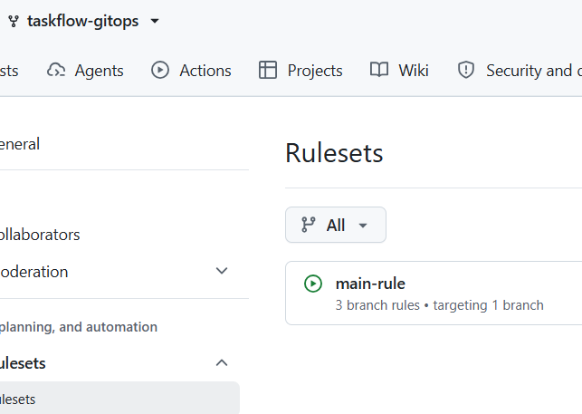

On vérifie qu'un push direct est bien refusé :


### Etape 2 : Installation de l'environnement

Ajout du pseudo dans `application.yaml` :

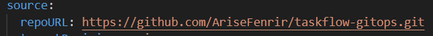

Lancement du script d'installation (`./scripts/install.sh`) :

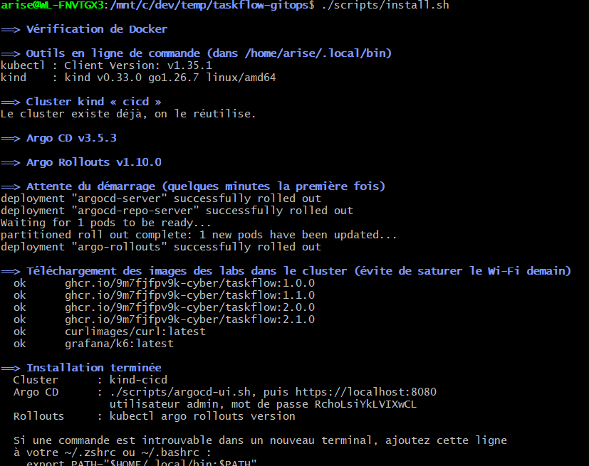

Application du manifeste Argo CD :


### Etape 3 : Vérification de la synchronisation

L'application est bien synchronisée dans Argo CD (Sync Status + Health Status) :


Lancement de `observe.sh` pour vérifier la répartition du trafic :

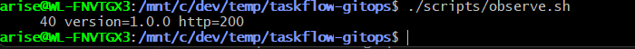

### Etape 4 : Première Pull Request de déploiement

Création de la PR pour déployer une nouvelle version de TaskFlow :

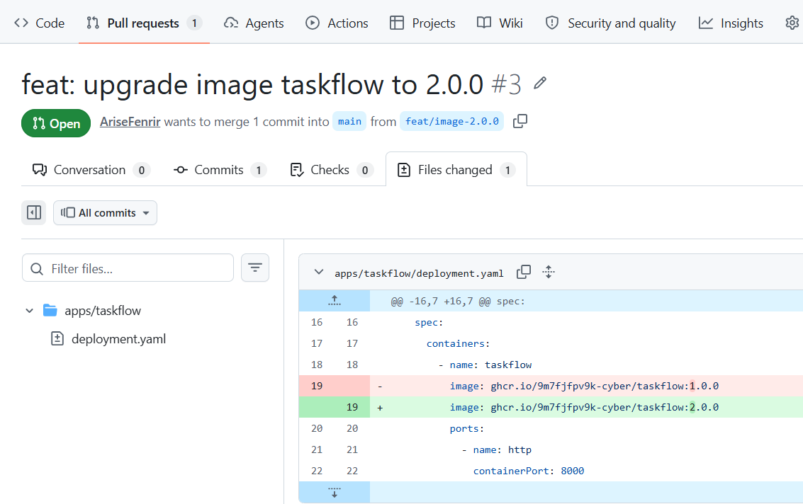

PR mergée à 11h52, le changement est visible dans Argo CD à 11h53 (~1 minute de délai) :


### Etape 5 : Test de dérive (self-heal)

On scale manuellement les replicas à 1 :


Argo CD remet immédiatement les 4 replicas grâce à `selfHeal: true` :

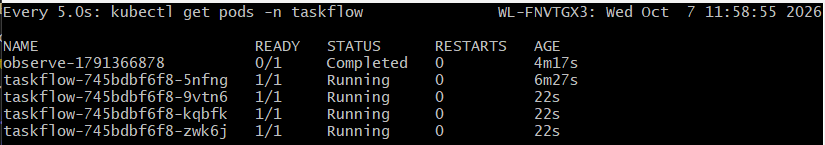

On tente de changer l'image manuellement avec `kubectl set image` — Argo CD corrige aussitôt et repasse en 2.0.0 :


### Etape 6 : Revert via Git

Un revert direct sur GitHub est bloqué par une PR intermédiaire (ajout du README) :

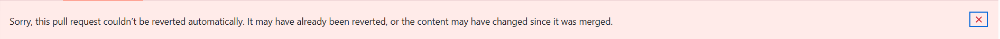

Solution : créer une branche avec l'image précédente et la merger dans `main`.

PR pour le revert :

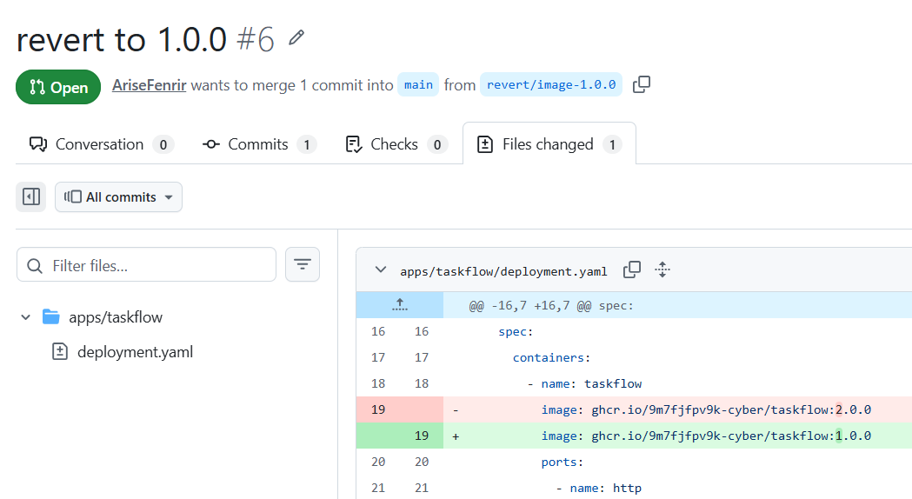

PR mergée à 12h22, retour effectif en 1.0.0 constaté à 12h24 :

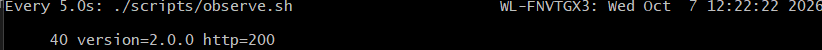


### Bonus : Suppression de service.yaml (Pruning)

Avant la suppression, le Service `taskflow` est présent dans Argo CD :


1. Création de la branche `feat/bonus-prune-service` et suppression de `apps/taskflow/service.yaml`.
2. Fusion de la PR #8 sur `main`.
3. Grâce à `prune: true`, Argo CD a automatiquement pruné la ressource Service du cluster :

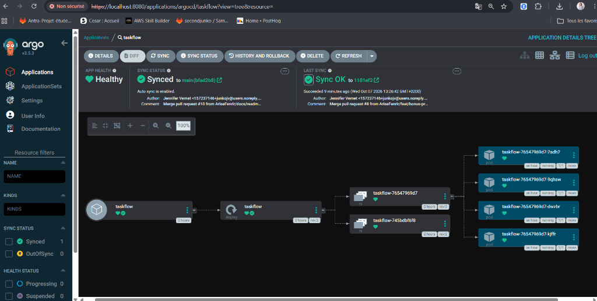

```bash
$ kubectl get svc -n taskflow
No resources found in taskflow namespace.
```

### Questions du livrable

**Push ou Pull ?**
Argo CD fonctionne en mode **Pull**. Il interroge le dépôt Git toutes les 60 secondes pour détecter les changements. Personne ne pousse vers le cluster — c'est Argo CD qui tire l'état depuis Git et l'applique.

**Qui a corrigé quoi ?**
C'est Argo CD qui a corrigé automatiquement les modifications manuelles (`kubectl scale`, `kubectl set image`). Grâce à `selfHeal: true`, il a détecté la dérive entre le cluster et Git, et a resynchronisé le cluster sur le dépôt (source de vérité).

**Pourquoi git revert ?**
Dans une approche GitOps, le dépôt Git est la **seule source de vérité**. On ne fait jamais de modification directement sur le cluster. Pour revenir en arrière, on fait un revert de la PR sur GitHub. Argo CD détecte le changement et redéploie automatiquement. Tout passe par Git = traçabilité complète, audit, historique, et review par PR.

---

## LAB Après-midi — Stratégies de déploiement avancées

### Partie A : Blue-Green Deployment

#### Etape 1 : Mise en place

Récupération des fichiers Blue-Green depuis `exemples/bluegreen/` et merge dans `main` :


Vérification dans Argo CD :

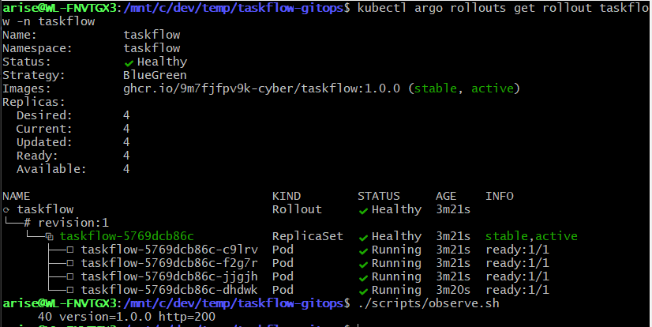

- Rollout taskflow créé avec stratégie BlueGreen, 4 pods en revision:1
- Status : Healthy, image 1.0.0 marquée stable et active
- 2 Services créés : `taskflow` (production) et `taskflow-preview`
- `observe.sh` : 40/40 requêtes → version=1.0.0 http=200

#### Etape 2 : Déploiement de la 1.1.0

Mise à jour de l'image vers 1.1.0 dans `rollout.yaml`, commit et push :

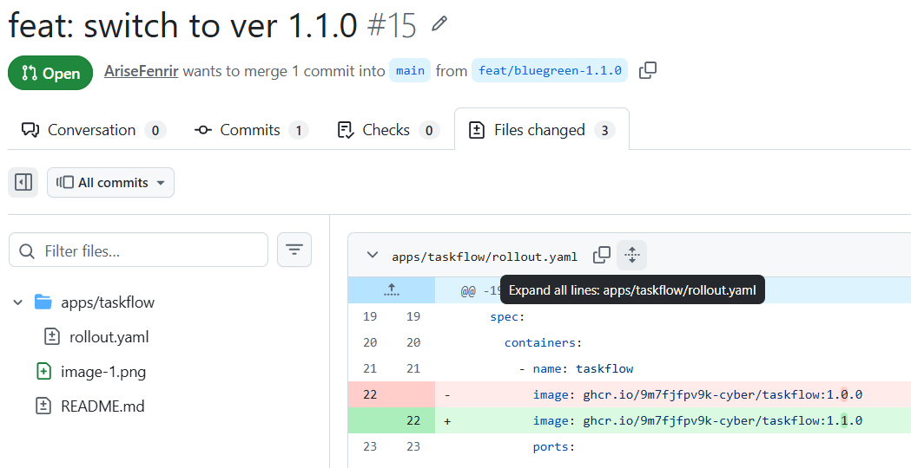

Après merge, on observe les 4 nouveaux pods 1.1.0 dans Argo CD :

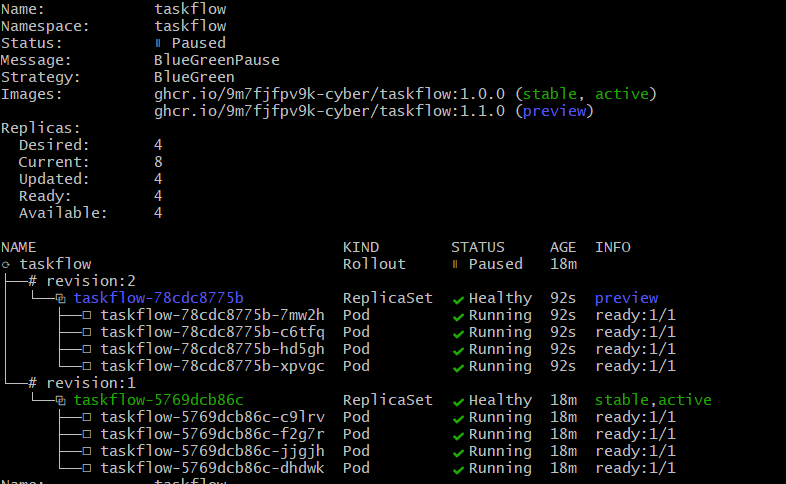

Il y a donc **8 pods au total** : 4 en 1.0.0 (stable) et 4 en 1.1.0 (preview). Le script `observe.sh` affiche toujours la 1.0.0 car c'est la version en production :

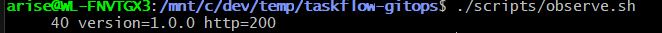

#### Etape 3 : Promotion

Lancement de la promotion manuelle :

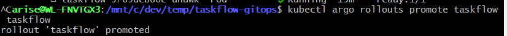

Les pods 1.0.0 ne sont plus utilisés, les pods actifs sont désormais ceux en 1.1.0 :

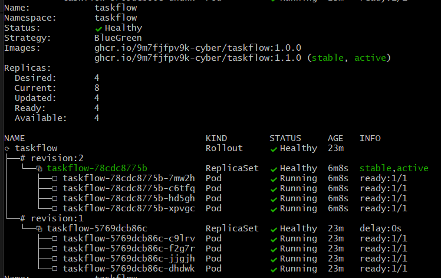

`observe.sh` confirme la version 1.1.0 :


Après 30 secondes, les pods de l'ancienne version sont supprimés :

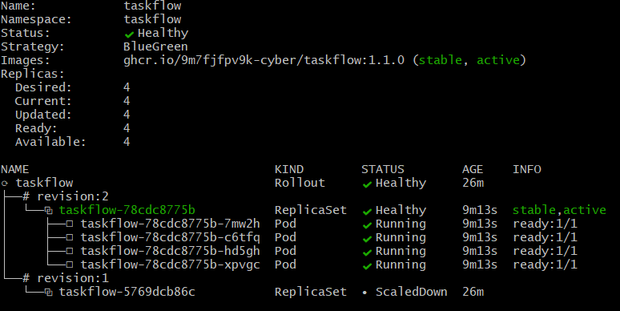

### Partie B : Canary Deployment

#### Etape 1 : Mise en place

Récupération des fichiers Canary depuis `exemples/canary/` et merge dans `main` :

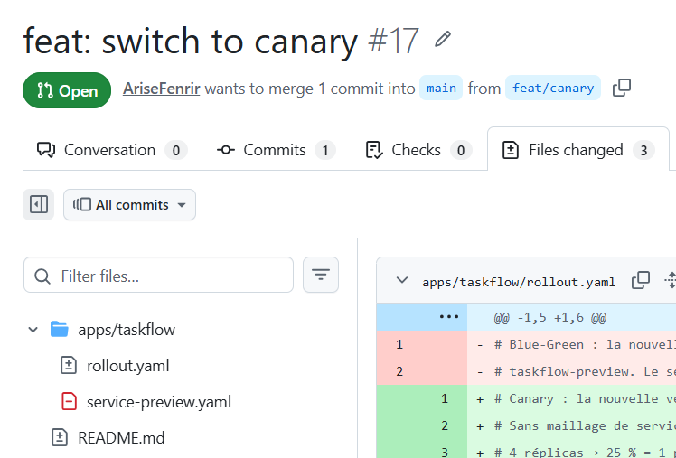

Vérification dans Argo CD :

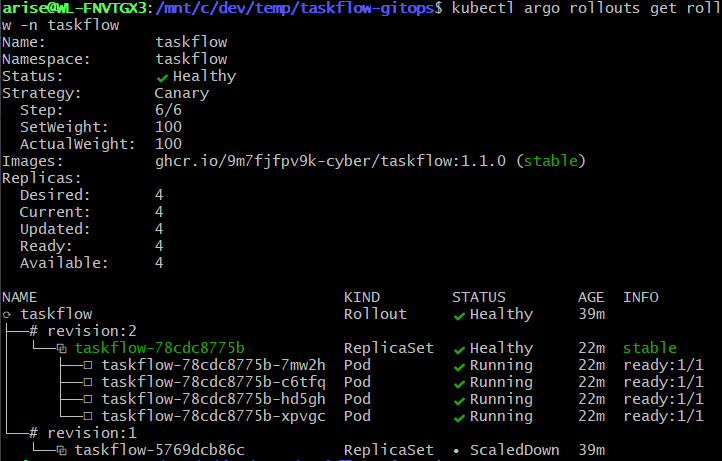

- Rollout taskflow avec stratégie Canary, 4 pods en revision:1
- Status : Healthy, image 1.1.0 stable et active


`observe.sh` : 40/40 requêtes → version=1.1.0 http=200

#### Etape 2 : Déploiement progressif vers 2.0.0

Mise à jour de l'image vers 2.0.0 :

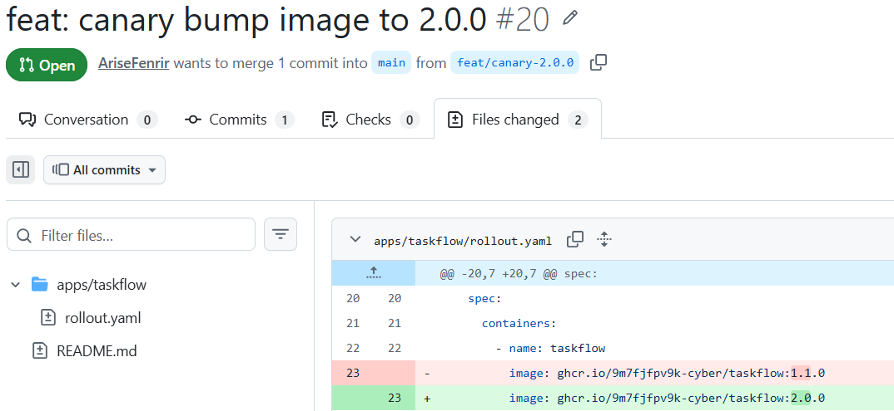

Le rollout démarre à **25%** (1 pod sur 4 en 2.0.0) :

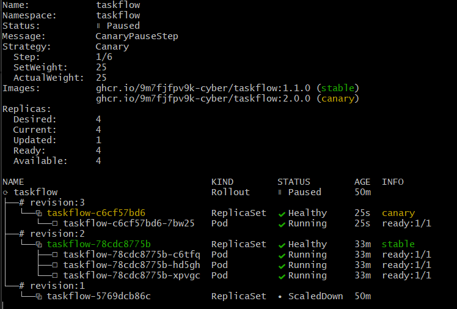


Passage à **50%** (2 pods sur 4) :

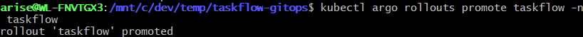

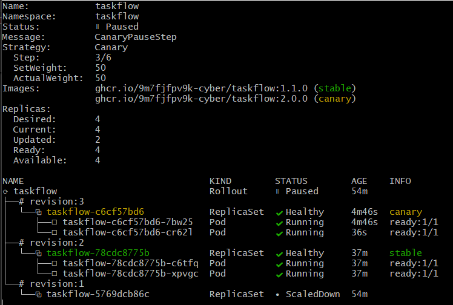

Passage à **75%** (3 pods sur 4) :

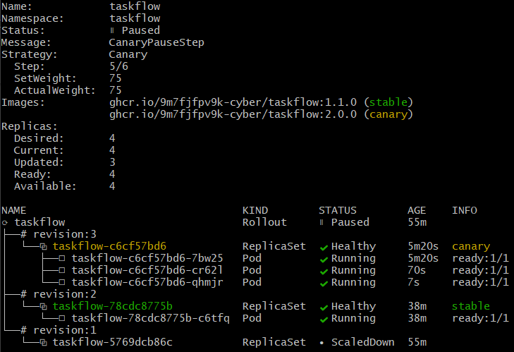

Et enfin **100%** (4 pods sur 4 en 2.0.0) :

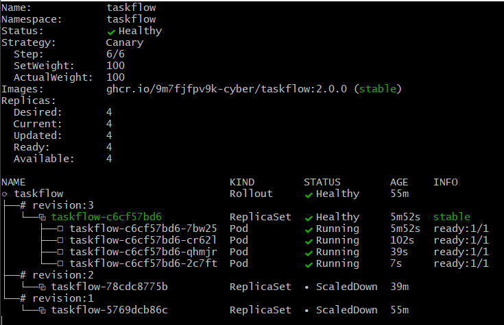

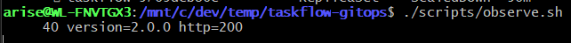

#### Etape 3 : Détection d'incident avec la 2.1.0

Passage en version 2.1.0 :

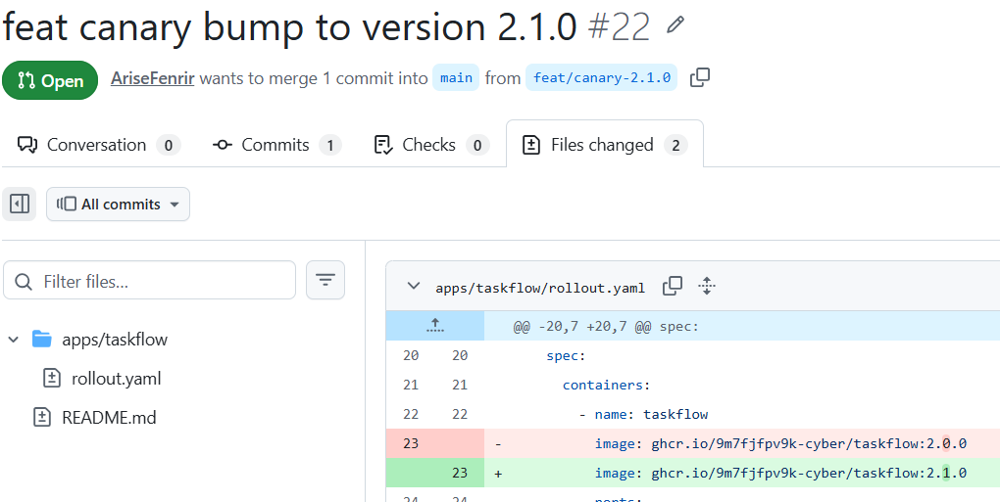

Les pods 2.1.0 sont créés :

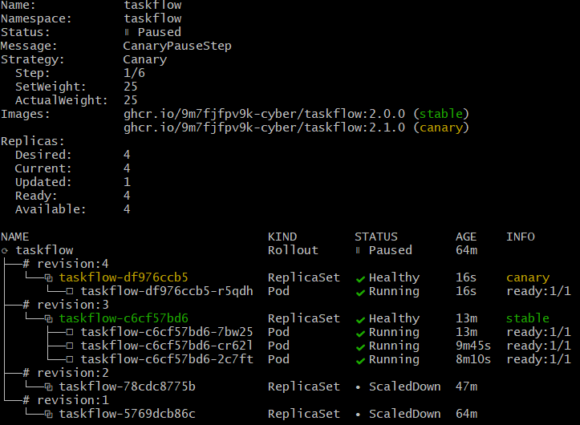

`observe.sh` révèle des **erreurs 500** sur la 2.1.0 (les réponses 200 diminuent, les 500 augmentent) :

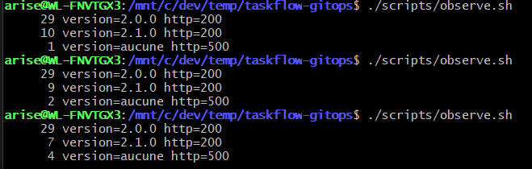

Lancement d'un **abort** du rollout pour revenir à la version stable :

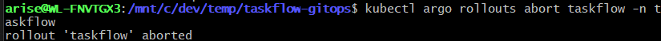

Le pod 2.1.0 est supprimé et recréé en 2.0.0 :

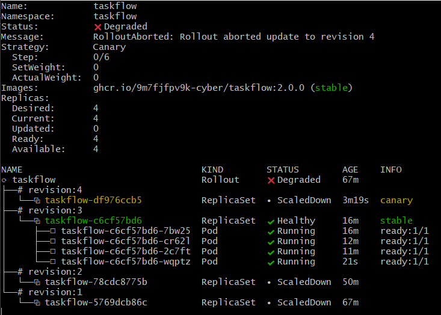

Plus aucune perte de requêtes dans `observe.sh` :

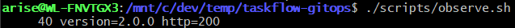

### Blue-Green ou Canary pour TaskFlow ?

Pour TaskFlow, la stratégie **Canary** est la plus adaptée :

| Critère | Blue-Green | Canary |
| --- | --- | --- |
| **Pods pendant le déploiement** | 8 (double) | 4 (constant) |
| **Exposition avant validation** | 0% (preview isolée) | 25% (trafic réel) |
| **Détection de bugs** | Post-promotion (100% d'un coup) | Progressive (25% → abort) |
| **Coût en ressources** | Élevé temporairement | Nul |

**Conclusion** : le Canary est le meilleur compromis pour TaskFlow. Il ne coûte rien de plus en ressources et permet de détecter les problèmes en production réelle tout en limitant l'impact sur les utilisateurs. Le Blue-Green reste pertinent pour des applications critiques où **aucun** utilisateur ne doit être exposé à une version non validée (paiement, données sensibles).
