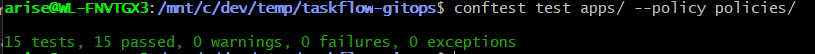
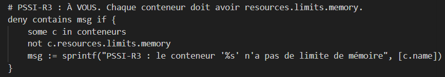
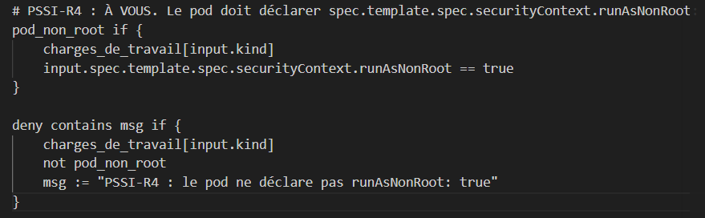
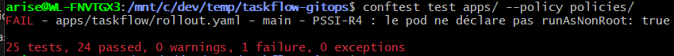

# Journal Jour 3 — Robustesse et analyse automatique

## Partie A : L'étalon et l'analyse

### Etape 1 : Sync du fork et baseline

On fait la pr pour sync avec le fork 

On confirme que le nouveau setup est mis en place sur le cluster

### Etape 2 : Test de charge baseline (étalon)

On a lancer le script charge.sh pour effectuer le test de charge baseline.

Dans le resultat on peut observer : 
0.00% d'erreur, (seuil < 2%)
p95 = 10.35ms (seuil < 250ms)
730 requêtes, 100% en statut 200

### Etape 3 : PR feat/analyse-auto

les fichier ont tous été mis en place au moment ou on a sync ce qui fait que la PR n'a pas nécessité de modifications supplémentaires.

### Etape 4 : Vérification des ressources

<!-- Résultats de :
  kubectl get rollout -n taskflow
  kubectl get deployment -n taskflow (aucun)
  kubectl get analysistemplate -n taskflow
  kubectl get configmap k6-robustesse -n taskflow
  kubectl get svc -n taskflow
-->

On verifie que toute les ressources sont pretes et configuré

---

## Partie B : L'incident

### Etape 1 : Déploiement de la 2.1.0 (image défectueuse)

<!-- PR : image 2.1.0
  kubectl argo rollouts get rollout taskflow -n taskflow --watch
  NE RIEN TOUCHER — observer l'analyse automatique
-->

### Etape 2 : Preuves de l'échec automatique

<!-- 
Preuve 1 : AnalysisRun en échec
  kubectl get analysisrun -n taskflow
  kubectl describe analysisrun <nom> -n taskflow

Preuve 2 : Logs du Job k6
  kubectl logs -n taskflow -l job-name=<nom-du-job>

Preuve 3 : Statut du rollout (Degraded)
  kubectl argo rollouts get rollout taskflow -n taskflow

Preuve 4 : observe.sh — la prod est restée en 2.0.0
-->

### Etape 3 : Revert de la PR 2.1.0

<!-- Revert via PR sur GitHub ou branche manuelle -->

### Etape 4 : Déploiement de la 2.2.0 (image corrigée)

<!-- PR : image 2.2.0
  kubectl argo rollouts get rollout taskflow -n taskflow --watch
  L'analyse k6 passe → canary continue : 25% → 50% → 75% → 100%
-->

<!-- Capture de l'AnalysisRun en succès :
  kubectl get analysisrun -n taskflow
  kubectl describe analysisrun <nom> -n taskflow
-->

### Etape 5 : Postmortem

Voir [postmortem-2.1.0.md](postmortem-2.1.0.md)

---

## Canary manuel vs Canary automatique

| Critère | Canary manuel (J2) | Canary avec analyse auto (J3) |
| --- | --- | --- |
| **Détection** | Humain via `observe.sh` | Job k6 automatique |
| **Décision d'abort** | `kubectl argo rollouts abort` manuel | Abort automatique par Argo Rollouts |
| **Temps de réaction** | Dépend de la vigilance de l'opérateur | ~30 secondes (durée du test k6) |
| **Intervention humaine** | Obligatoire | Aucune |
| **Risque d'oubli** | Élevé (nuit, week-end, distraction) | Nul |
