# Journal Jour 3 — Robustesse, analyse automatique et PSSI

## Partie A : L'étalon et l'analyse

### Etape 1 : Sync du fork et baseline

On fait la pr pour sync avec le fork 
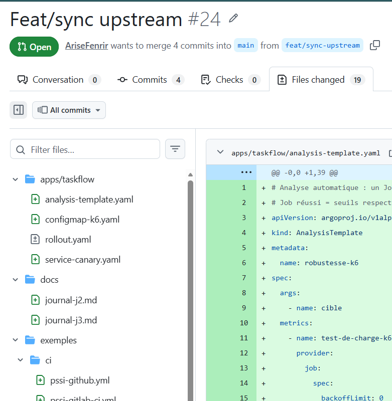

On confirme que le nouveau setup est mis en place sur le cluster
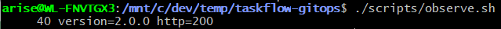

### Etape 2 : Test de charge baseline (étalon)

On a lancer le script charge.sh pour effectuer le test de charge baseline.

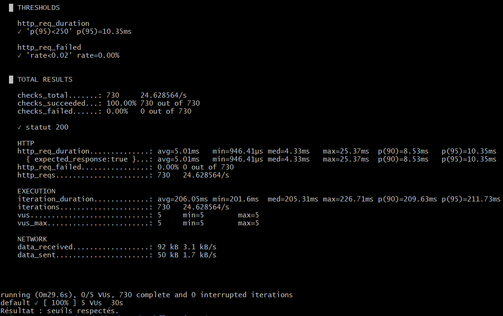

Dans le resultat on peut observer : 
0.00% d'erreur, (seuil < 2%)
p95 = 10.35ms (seuil < 250ms)
730 requêtes, 100% en statut 200

### Etape 3 : PR feat/analyse-auto

les fichier ont tous été mis en place au moment ou on a sync ce qui fait que la PR n'a pas nécessité de modifications supplémentaires.

### Etape 4 : Vérification des ressources

<!-- Résultats de :
  kubectl get rollout -n taskflow
  kubectl get deployment -n taskflow (aucun)
  kubectl get analysistemplate -n taskflow
  kubectl get configmap k6-robustesse -n taskflow
  kubectl get svc -n taskflow
-->

On verifie que toute les ressources sont pretes et configuré
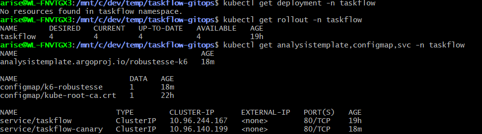

---

## Partie B : L'incident

### Etape 1 : Déploiement de la 2.1.0 (image défectueuse)

<!-- PR : image 2.1.0
  kubectl argo rollouts get rollout taskflow -n taskflow --watch
  NE RIEN TOUCHER — observer l'analyse automatique
-->

on fait la pr pour déployer l'image 2.1.0

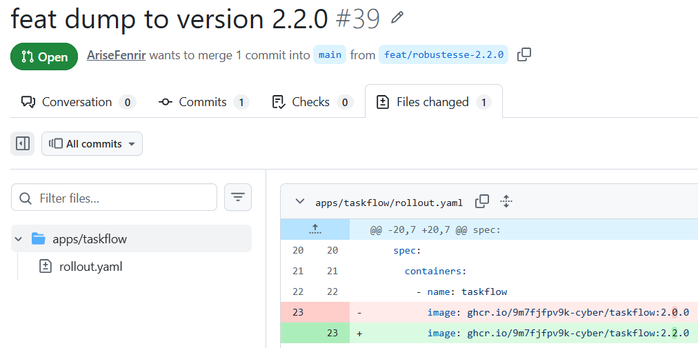

le test avec k6 se lance a 25%
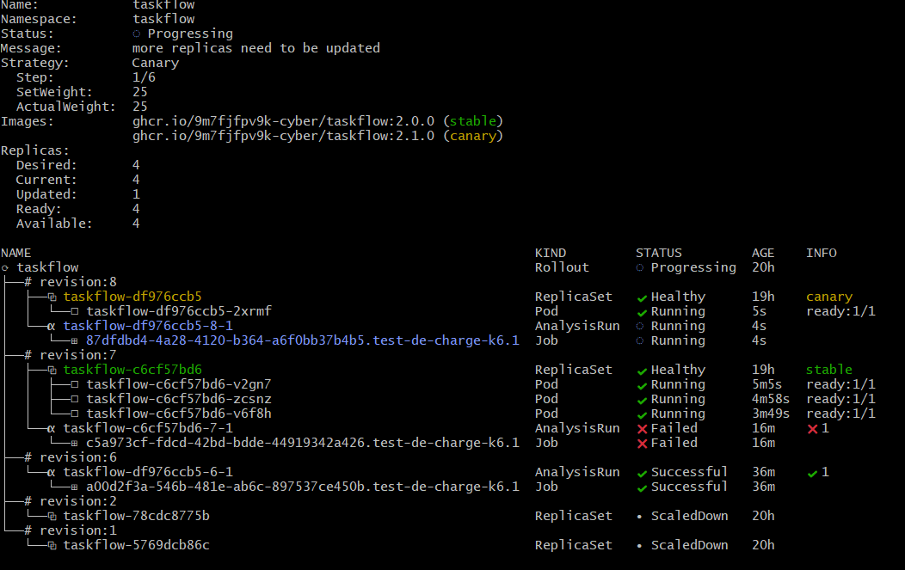

et on remarque apres le message d'erreur
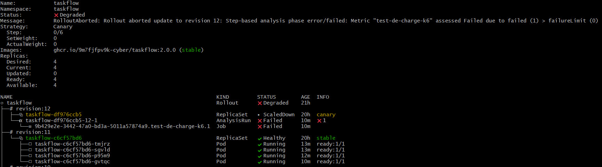

### Etape 2 : Preuves de l'échec automatique

on peut check le fait que l'analysis run a bine echouer (ici c'est celle de 11m a prendre en compte)
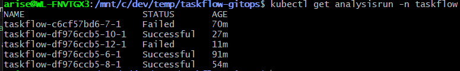

on peut observer les log du job k6 dans lequel l'échec s'est produit.
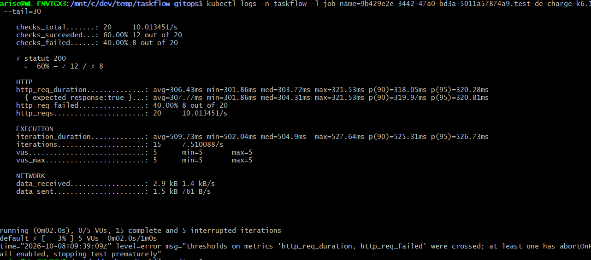

on peut egalemnt check les log du analysis run 
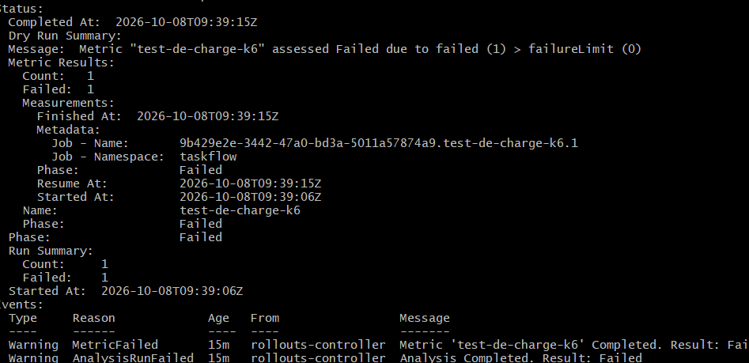

Enfin on peut observer le statut du rollout qui est passé en Degraded.
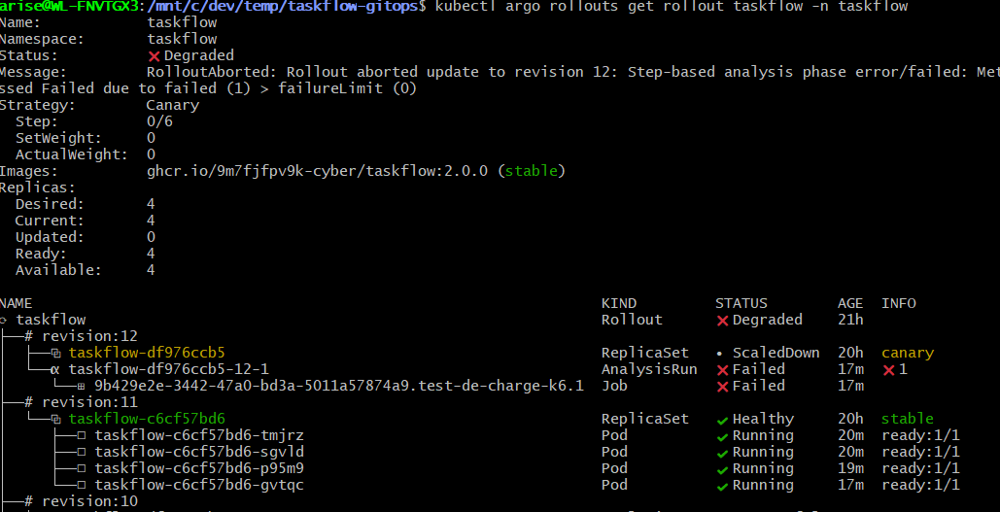

### Etape 3 : Revert de la PR 2.1.0

On fait la PR pour revert la version 2.1.0 et revenir à la version précédente.
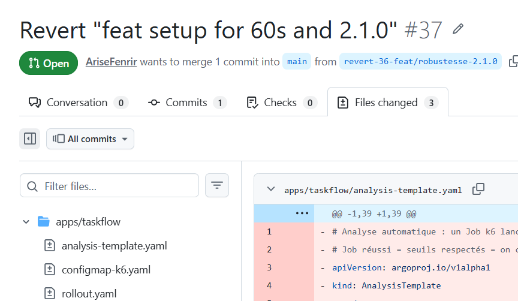

### Etape 4 : Déploiement de la 2.2.0 (image corrigée)

<!-- PR : image 2.2.0
  kubectl argo rollouts get rollout taskflow -n taskflow --watch
  L'analyse k6 passe → canary continue : 25% → 50% → 75% → 100%
-->
on fait la pr pour déployer l'image 2.2.0

le test avec k6 se lance a 25%
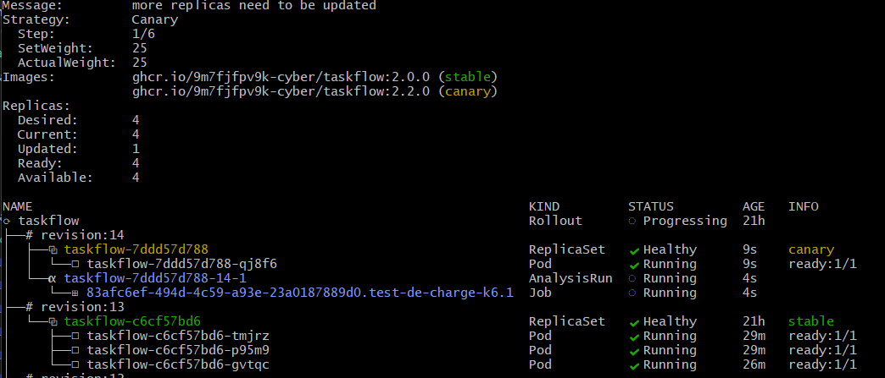

et on peut observer que le test a réussi et que le rollout continue.
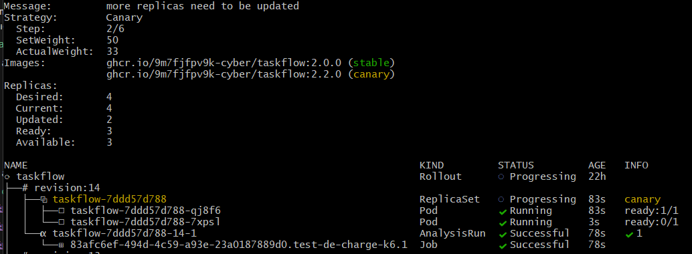

le rollout fini avec succès.
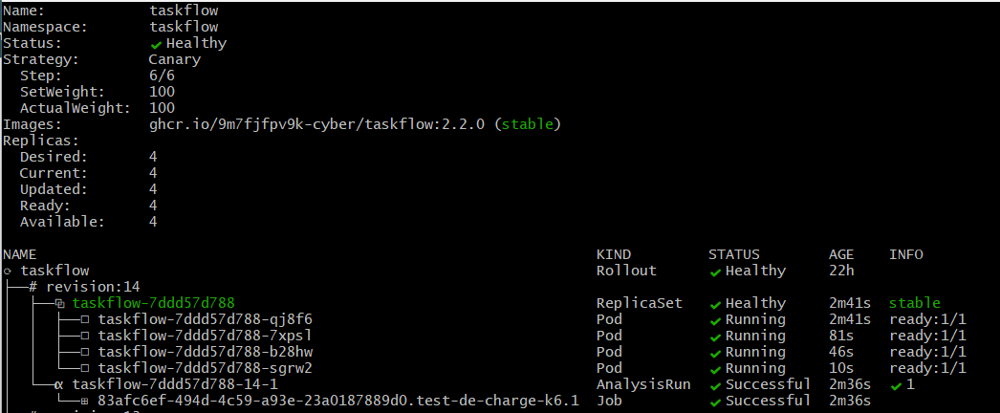

### Etape 5 : Postmortem

Voir [postmortem-2.1.0.md](postmortem-2.1.0.md)

---

## Canary manuel vs Canary automatique

| Critère | Canary manuel (J2) | Canary avec analyse auto (J3) |
| --- | --- | --- |
| **Détection** | Humain via `observe.sh` | Job k6 automatique |
| **Décision d'abort** | `kubectl argo rollouts abort` manuel | Abort automatique par Argo Rollouts |
| **Temps de réaction** | Dépend de la vigilance de l'opérateur | ~30 secondes (durée du test k6) |
| **Intervention humaine** | Obligatoire | Aucune |
| **Risque d'oubli** | Élevé (nuit, week-end, distraction) | Nul |

---

## Partie C : La mini-PSSI en quality gates

### Etape 1 

On commence par lancer le conftest:

Actuellement tout les tests configurer passent.

### Etape 2

Ecriture de R3 :

Ecriture de R4 :

Après relance de conftest, **R4 échoue** car le rollout n'a pas de `securityContext.runAsNonRoot`.

### Etape 3

On ajoute `securityContext: runAsNonRoot: true` dans `apps/taskflow/rollout.yaml` au niveau du pod.
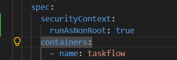

Puis on relance le conftest : toutes les règles R1 à R4 passent et on voit que les 25 test passent.

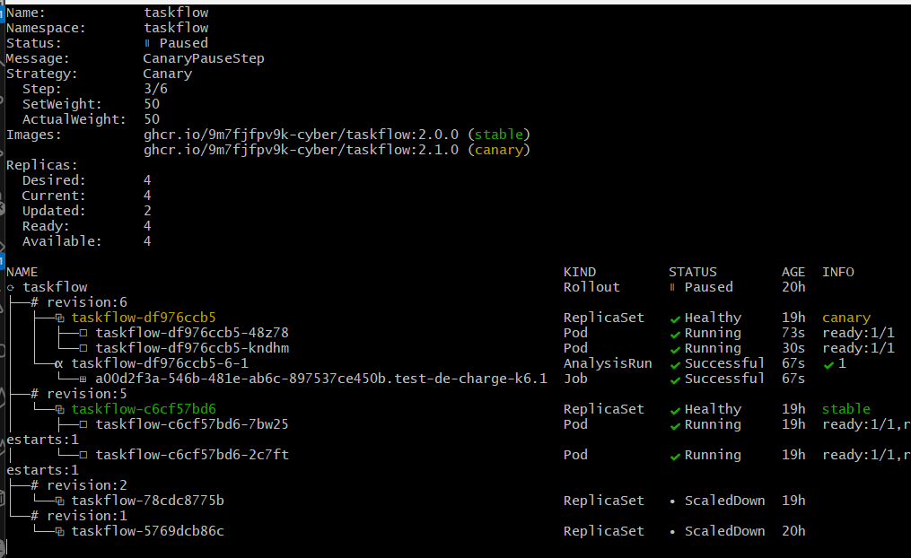

### Etape 4

On copie le workflow GitHub Actions :
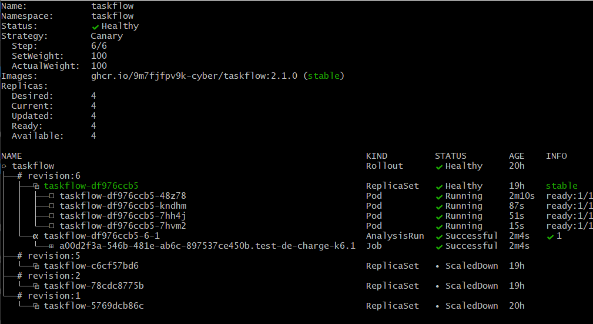

on fait ensuite la pr qu'on merge dans main

On peut ensuite voir que la CI se lance bien et que le job conftest pass mais pas trivy comme attendu
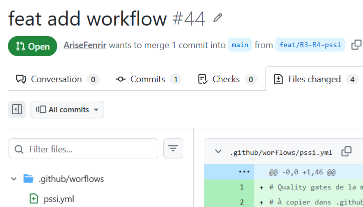

### Etape 5

Dans la ruleset GitHub, on ajoute les deux status checks obligatoires :
- **PSSI manifests (conftest)**
- **PSSI images (Trivy)**

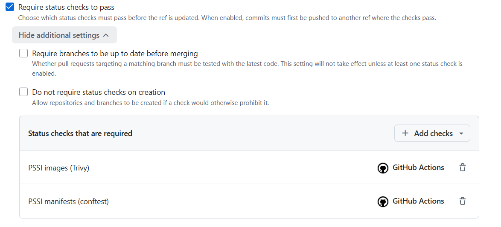

### Etape 6

On crée une PR avec une image non conforme (`nginx:latest`) pour vérifier que les quality gates bloquent bien le merge.

Les checks échouent :
- R1 : tag `latest` interdit
- R2 : image `nginx` hors du registre autorisé

### Etape 7

On remet notre image conforme (`ghcr.io/9m7fjfpv9k-cyber/taskflow:2.2.0`) dans le déploiement.

Sauf que comme vu avant le job Trivy peut encore échouer si des vulnérabilités HIGH/CRITICAL sont présentes dans l'image. On va ajouter des exceptions dans `.trivyignore`.

Comme demander dans le R5 on a date et mis la limite des exception de toute les cve qui sont en high et critical (pour les voir on peux regarder les pipelines Trivy que on a lancer précédemment)

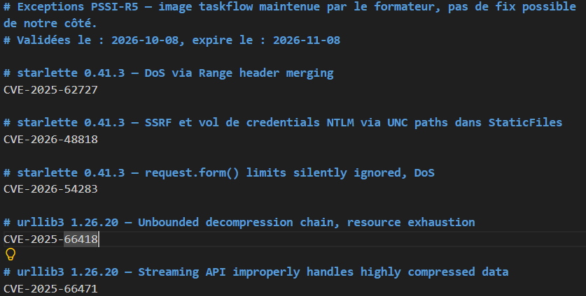

Apres l'ajout de trivyignore, on peux voir que le job Trivy ne bloque plus la CI malgré la présence de vulnérabilités HIGH/CRITICAL dans l'image.

### Tableau récapitulatif : Règle → Contrôle → Outil → Preuve

| Règle | Exigence | Outil | Résultat |
| --- | --- | --- | --- |
| **PSSI-R1** | Tag explicite, jamais `latest` | conftest | PR `nginx:latest` bloquée |
| **PSSI-R2** | Registre `ghcr.io/9m7fjfpv9k-cyber/` uniquement | conftest | PR `nginx` bloquée |
| **PSSI-R3** | Limite de mémoire sur chaque conteneur | conftest | Validé (256Mi configuré) |
| **PSSI-R4** | `runAsNonRoot: true` sur les pods | conftest | Corrigé dans le rollout |
| **PSSI-R5** | Aucune CVE HIGH/CRITICAL corrigeable | Trivy | Scanné en CI |
